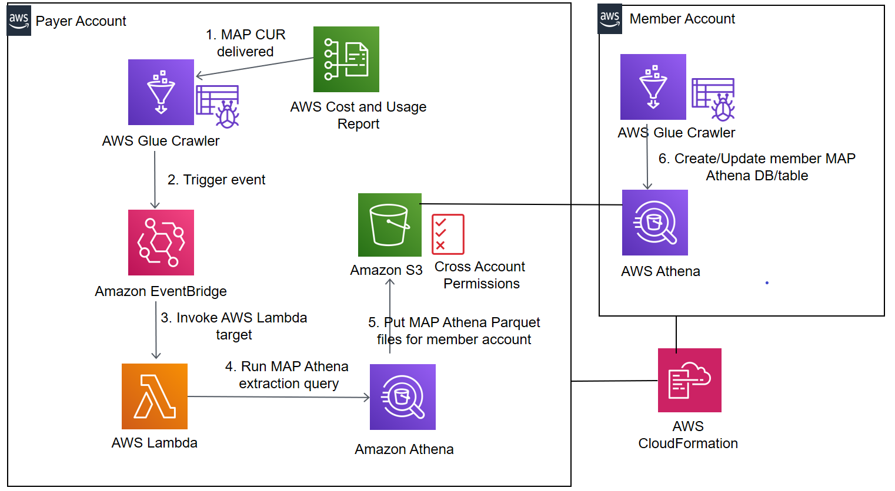

# Automating custom cost and usage tracking for member accounts in the AWS MAP 

Provides fully automated tracking to member account owners on both their spend and credits for their AWS MAP tagged resources

## How it Works

1. Provisions a AWS CloudWatch Events Rule in the payer account that is triggered based on the successful completion of the AWS Glue Crawler.
a. The Crawler runs in the payer account each time a MAP CUR report is delivered there and creates/updates the Athena database and table for the MAP CUR report
2. Provisions an output results S3 bucket in the payer account with an attached event notification to assign view permissions to objects in the S3 bucket to the member account
3. Provisions an AWS Lambda as a target of the CloudWatch Events Rule. 
a.	The AWS Lambda runs a customized Athena query specific to MAP tagged resources in the member account.
b.	The Athena query results for the MAP tagged resources in the member account are dropped in the output results S3 bucket.
4. Provisions an AWS Glue Crawler in the member account that has cross account access to the output results S3 bucket in the payer account	
a.	 The AWS Glue Crawler creates an Athena database and table in the member account. This enables member account owner to view and query data for MAP tagged resources specific to their account. 
5.	Steps 1-4 above are fully automated in AWS CloudFormation. It is deployed with 1-click automation. It requires no AWS related configurations to be performed by the AWS administrator.

## Solution Design

## How To Install

**Prerequisites**

1.	Set up Athena integration for MAP based Cost and Usage Reports in the Payer Account as documented here - https://docs.aws.amazon.com/cur/latest/userguide/cur-query-athena.html

**Setup** 

2 step install:

1.	Payer Account - Launch the **aws-map-payeraccountsetup.yml** template
	1.	Provisions steps 1-3 described above in the 'How it Works section

2.	Member Account - Launch the **aws-map-linkedaccountcrawler.yml** template
	1. Provisions step 4 described above in the How it Works section

